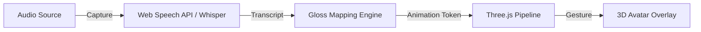

# 🤟 Echo-Sign: Real-Time Sign Gesture Mirror

**Bridging the Communication Gap for the Deaf and Hard-of-Hearing Community through Real-Time 3D Interpretation.**

---

## 📺 Demo Video DRIVE LINK

https://drive.google.com/file/d/12yBv0TOKdDxfsf1MJxKD4Vobe9mehhW5/view?usp=sharing

---

## ⚡ Problem Statement
Deaf and hard-of-hearing students face significant barriers in understanding live lectures, online classes, and educational videos because most learning environments rely heavily on spoken communication.

While captions provide some support, they are often:
- **Too fast** to read in real time.
- **Not aligned** with Indian Sign Language (ISL) grammar.
- **Unable to convey** tone, emotion, or technical clarity.

There is currently no real-time, scalable solution that converts live lecture audio directly into accurate Indian Sign Language representation in an accessible and natural way.

## 🚀 The Solution (MVP)
**Echo-Sign** is a real-time Chrome Extension that bridges this gap. It captures live speech or tab audio and instantly renders it into **Sign Gestures** via a 3D avatar overlay. This provides a "Sign Language Mirror" that lives directly on any website, enabling an inclusive learning experience without disrupting the original content.

### Key MVP Features
- **Real-Time 3D Avatar**: A humanoid avatar that interprets speech into fluid sign gestures on any webpage.
- **Dual Capture Modes**: Supports both **Microphone** (for live lectures) and **Tab Audio** (direct capture from YouTube/lectures).
- **Callback-Sync Driver**: A robust state-machine ensures the avatar's gestures and the on-screen captions are perfectly synchronized.
- **Fingerspelling Fallback**: For technical terms not in the dictionary, the avatar performs ISL handshape fingerspelling.
- **Intervention-Free Demo**: A curated walkthrough depicting common educational scenarios.

## 🌟 Why it Matters (The "Deaf-First" Approach)
Traditional education and tech-tools are rarely designed with a **Deaf-First** mindset. Echo-Sign isn't just about transcription; it's about **representation**. 
- **Visual-First Learning**: For many, sign language is the primary language, not just a translation tool.
- **Empowerment**: By providing a 3D interpreter, we give deaf students the autonomy to learn in their natural language.
- **Inclusion**: Breaking the isolation of spoken lectures by integrating a visual bridge directly into the browser.

---

## 🏗️ Technical Architecture

### Data Flow

1.  **Capture Layer**: Uses `chrome.tabCapture` and Web Speech APIs to extract audio chunks.
2.  **Processing Layer**: Whisper API (via Offscreen Document) or Web Speech transcribes text; a dictionary-based mapper converts words to animation "tokens."
3.  **Rendering Layer**: A Three.js engine injected into the page manages a 3D GLB character and a buffer/queue system for seamless gesture transitions.
4.  **Synchronization**: A message-based callback system between the content script and the iframe ensures zero drift between audio, text, and visual signs.

---

## 🛠️ Tech Stack
| Component | Technology |
|---|---|
| **Core Extension** | Chrome Manifest V3, Service Workers |
| **3D Engine** | Three.js (r160), GLTFLoader |
| **Transcription** | Web Speech API, OpenAI Whisper API |
| **Styling** | Vanilla CSS (Glassmorphism UI) |
| **Build Tools** | Esbuild (for Avatar Script bundling) |

---

## 📁 Project Structure
- `manifest.json`: Extension configuration and permissions.
- `content.js`: The "brain" — handles UI injection, logic, and orchestration.
- `src/avatarContent-src.js`: Core Three.js logic and animation state machine.
- `src/glossMap.js`: Dictionary mapping English concepts to sign gestures.
- `offscreen.js`: Handles high-performance tab audio capture and API routing.
- `assets/animations/`: Collection of GLB-based sign gestures.

---

## 🛠️ Installation
1.  Clone this repo.
2.  Go to `chrome://extensions` in Google Chrome.
3.  Enable **Developer Mode**.
4.  Click **Load Unpacked** and select the project folder.
5.  Pin Echo-Sign and start interpreting!

---
*Built for the jury review — Focused on Scalability and Accessibility.* 🤟
